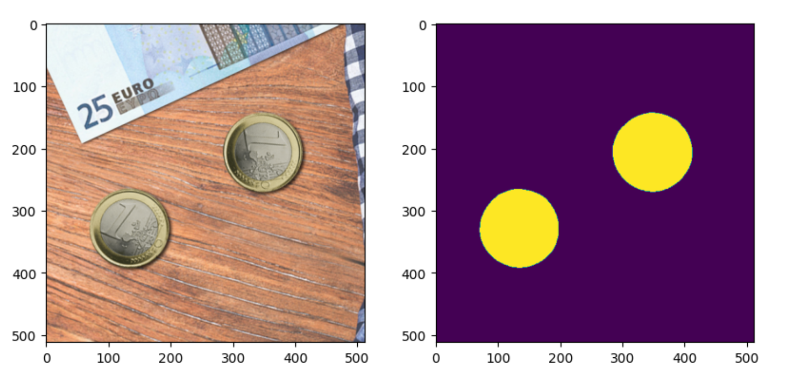
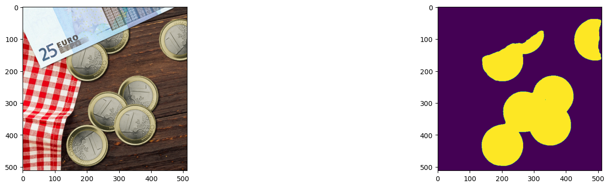
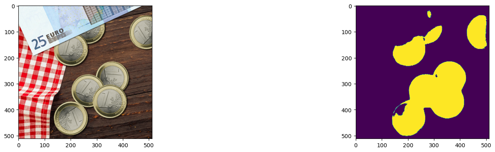
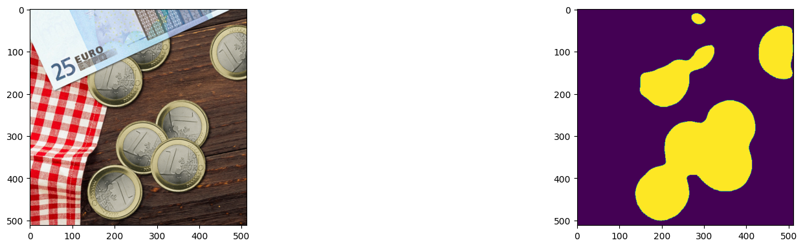
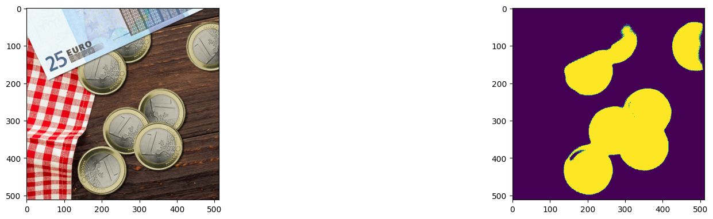
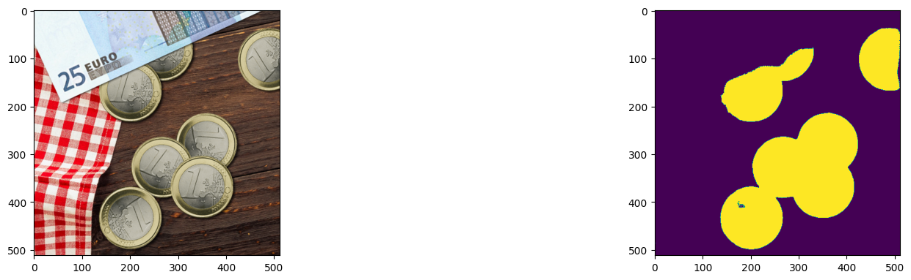

# **U-Net**
---


---

## **Introducción**

Este proyecto presenta la implementación y evaluación de un modelo U-Net aplicado a tareas de segmentación semántica. El objetivo principal es analizar el rendimiento del modelo U-Net bajo distintas configuraciones arquitectónicas y evaluar cómo las modificaciones en las conexiones skip afectan a la precisión y a la pérdida.

---

## **Descripción**

Este proyecto explora la arquitectura U-Net aplicada a la tarea de segmentación de imágenes mediante diferentes configuraciones y modificaciones estructurales. Se centra en evaluar cómo el diseño de conexiones Skip y el ajuste de canales afecta el rendimiento del modelo, tanto en términos de precisión como de pérdida, en un contexto de segmentación de objetos en imágenes complejas.

El estudio incluye la evaluación de tres enfoques principales: 

- Modelos con configuraciones dinámicas de canales

- Modelos con eliminación progresiva de conexiones Skip desde fuera hacia dentro

- Modelos con eliminación progresiva de conexiones Skip desde dentro hacia fuera. 

Cada variante del modelo fue entrenada y evaluada exhaustivamente para medir su capacidad de generalización, estabilidad en el entrenamiento y precisión en la segmentación.

---

## **Estructura del Proyecto**

``` bash
Unet/
├── images/             # Imágenes de entrada utilizadas durante el entrenamiento
├── labels/             # Máscaras de segmentación asociadas a las imágenes de entrenamiento
└── test/              # Imágenes y máscaras empleadas para la evaluación del modelo
```
---

## **Conjunto de Datos**

El conjunto de datos consta de:

- **Imágenes de entrada:** Fotografías en formato RGB con resoluciones consistentes.

- **Máscaras de segmentación:** Mapas binarios que indican las áreas de interés.

Las imágenes han sido preprocesadas para normalizarlas al rango [0, 1]. Las máscaras se han ajustado para codificar áreas de interés en valores binarios (0 y 1).

---

## **Análisis de Resultados**

### Modelos Dinámicos y Base

| **Modelo**                                                                 | **Loss (Train)** | **Loss (Test)** | **Accuracy (Train)** | **Accuracy (Test)** | **Visualización de Resultados**       |
|---------------------------------------------------------------------------|------------------|-----------------|----------------------|---------------------|----------------------------------------|
| 1. U-Net Estándar con Configuración Predeterminada                        | 0.0008           | 0.0492          | 99.96%               | 94.97%              |      |
| 2. U-Net Dinámico con Configuración Base de Canales                       | 0.0008           | 0.0484          | 99.97%               | 95.11%              |      |
| 3. U-Net Dinámico con Configuración Reducida de Canales                   | 0.0010           | 0.0497          | 99.96%               | 94.63%              |      |
| 4. U-Net Dinámico con Configuración Más Ligera de Canales                 | 0.0013           | 0.0502          | 99.95%               | 94.88%              |      |
| 5. U-Net Dinámico con Configuración Mínima de Canales                     | 0.0016           | 0.0470          | 99.92%               | 94.52%              |      |

---

## Modelos con Eliminación de Conexiones de Fuera hacia Dentro

| **Modelo**                                                                 | **Loss (Train)** | **Loss (Test)** | **Accuracy (Train)** | **Accuracy (Test)** | **Visualización de Resultados**       |
|---------------------------------------------------------------------------|------------------|-----------------|----------------------|---------------------|----------------------------------------|
| 6. U-Net sin Conexión Skip en la Última Capa (Stage 1)                    | 0.0108           | 0.0359          | 99.75%               | 94.82%              |      |
| 7. U-Net sin Conexiones Skip en d3 y d4 (Stage 2)                         | 0.0018           | 0.0447          | 99.90%               | 94.86%              |      |
| 8. U-Net sin Conexiones Skip en d2, d3 y d4 (Stage 3)                     | 0.0012           | 0.0377          | 99.94%               | 94.96%              |      |

---

## Modelos con Eliminación de Conexiones de Dentro hacia Fuera

| **Modelo**                                                                 | **Loss (Train)** | **Loss (Test)** | **Accuracy (Train)** | **Accuracy (Test)** | **Visualización de Resultados**       |
|---------------------------------------------------------------------------|------------------|-----------------|----------------------|---------------------|----------------------------------------|
| 10. U-Net con Eliminación Progresiva de Conexiones Skip en d4 (Stage 1)   | 0.0014           | 0.0479          | 99.96%               | 94.06%              |    |
| 11. U-Net con Eliminación Progresiva de Conexiones Skip en d4 y d3 (Stage 2)| 0.0016          | 0.0499          | 99.94%               | 94.89%              |    |
| 12. U-Net con Eliminación Progresiva de Conexiones Skip en d4, d3 y d2 (Stage 3)| 0.0037      | 0.0596          | 99.87%               | 93.58%              |    |

---

## **Conclusiones**

Los resultados demuestran que las conexiones Skip en el modelo U-Net son fundamentales para mantener un buen equilibrio entre pérdida y precisión. Los modelos dinámicos alcanzaron altos niveles de precisión, destacando el modelo con configuración base de canales con 95.11% en prueba. En las configuraciones con eliminación progresiva, se observó una disminución en el rendimiento a medida que se eliminaban más conexiones, especialmente en las etapas finales, donde la precisión cayó hasta 93.58%. Esto subraya la importancia de diseñar cuidadosamente la estructura del modelo para maximizar su capacidad de generalización sin comprometer su desempeño.

---

## **Autores** ✒️

* **Hernández Guerra, Luna Yue** - [lunahernandez](https://github.com/lunahernandez)
* **Casimiro Torres, Kimberly** - [Kimberlycasimiro](https://github.com/Kimberlycasimiro)

#### **Universidad de Las Palmas de Gran Canaria (ULPGC)**